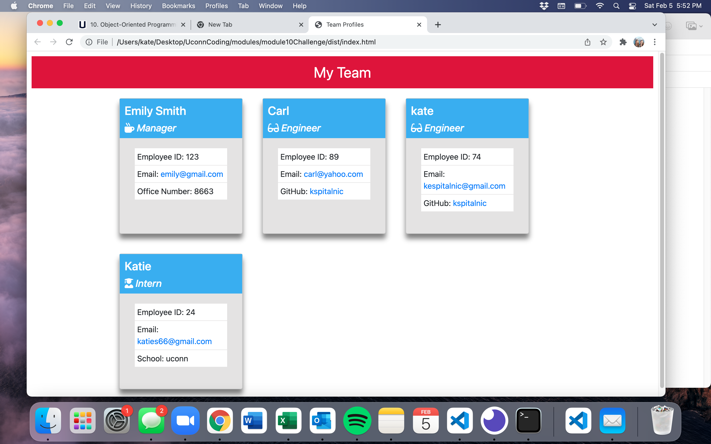

# Team Profile Generator

This application generates a team profile page after accepting user inputs from the command line. 

## Installation and Usage 

To use this application, it is necessary to clone the repository, cd into the folder with the index.js, and enter "node index" into the command line. Then, the user can respond to the prompts. After responding, an index.html file is generated and the user can open this in their browser to see their staff team cards.

To test this application, open its directory in VS code and type 'npm run test' into the terminal. All tests should pass for the 4 tested classes.

Example: EXAMPLE VIDEO HERE 

## Strategies Used 
* Object Oriented Programming
* Classes and Constructors
* Test driven development
* Node
* NPM - inquire, path, fs
* JavaScript
* Arrow functions arrays

 

## GitHub 
Link to Repo: https://github.com/kspitalnic/teamProfileGenerator_OOP

   

Screenshot: 
